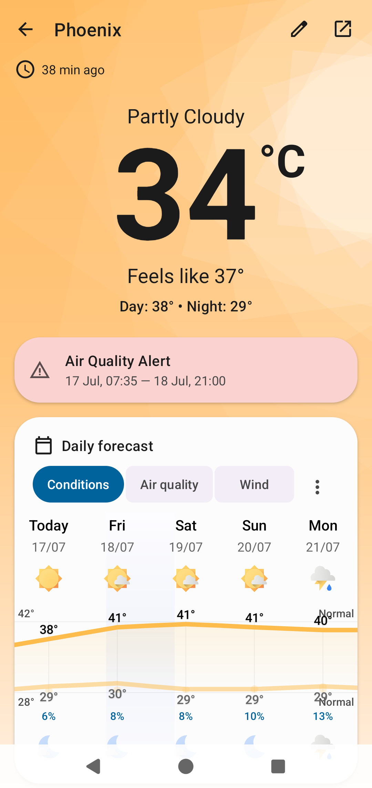
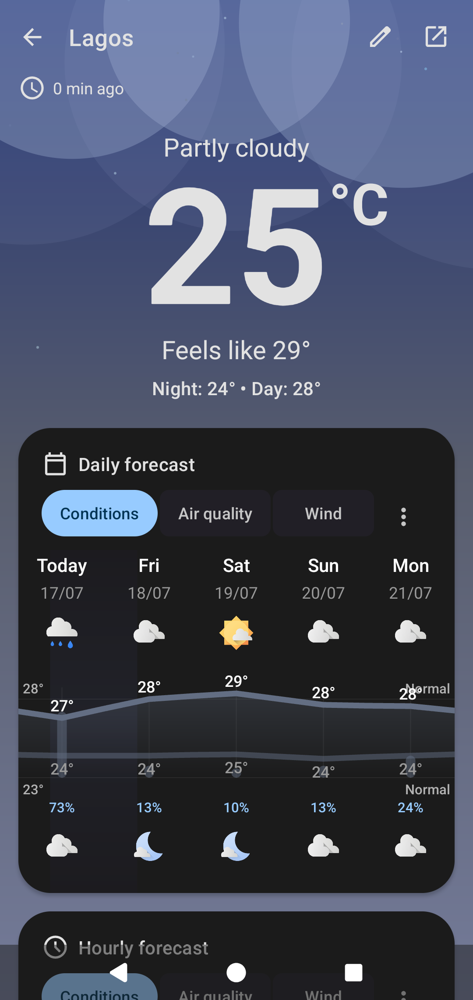
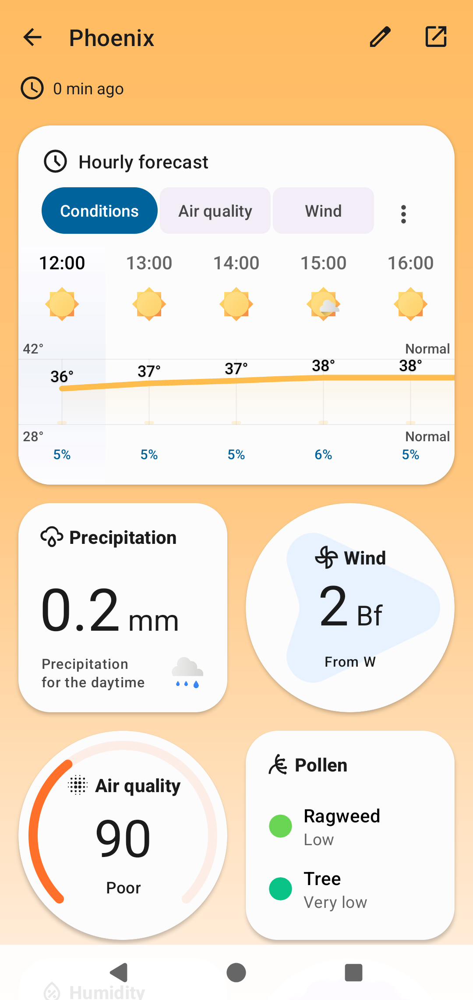
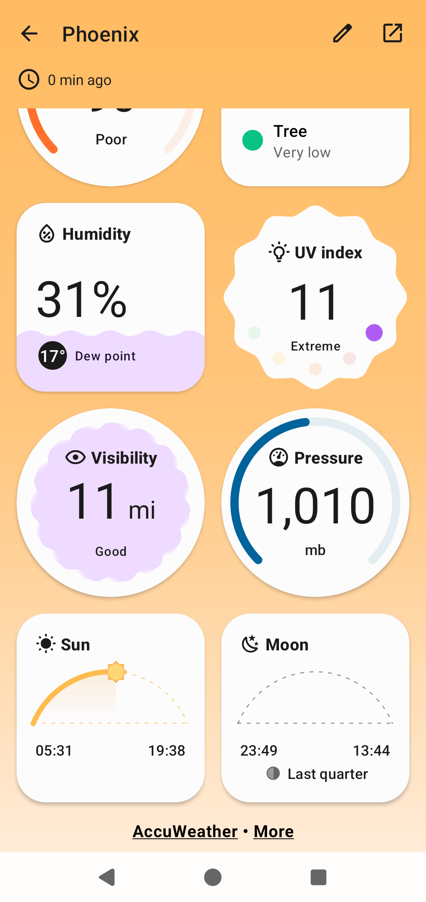
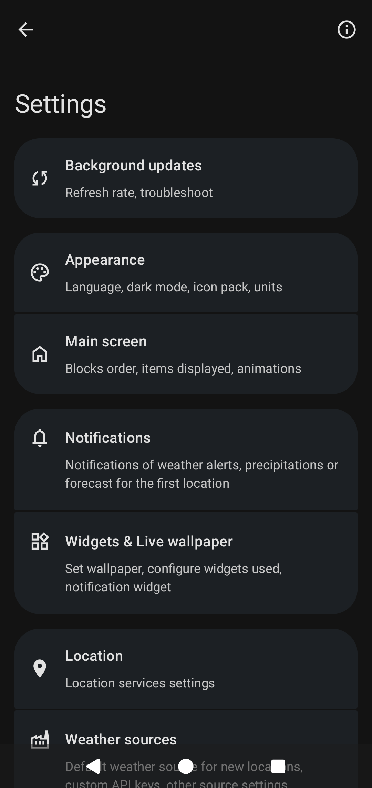
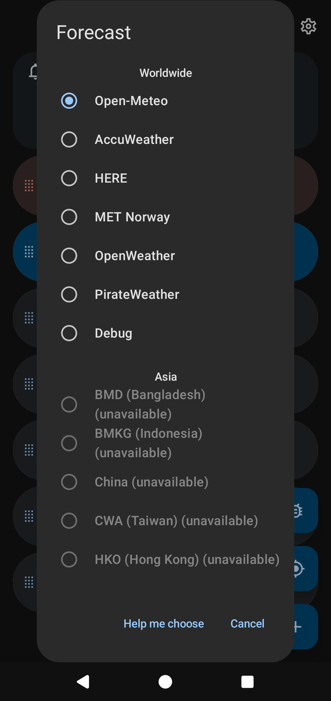
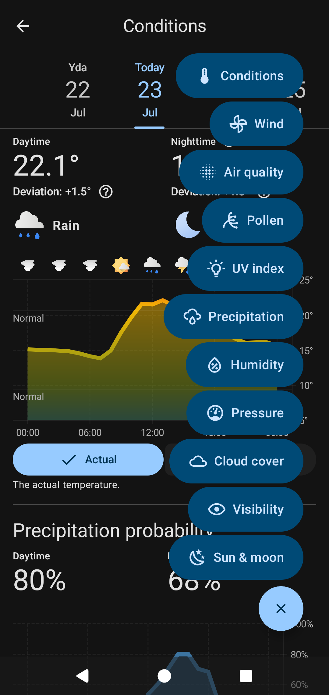

   
  

<h1 align="center">🌤️ Breezy Weather</h1>

  A feature-rich, free and open-source <strong>Material 3 Expressive</strong> weather app with intuitive visualizations. Supports forecasts, nowcasting, air quality, pollen, alerts, and more from over 50 weather sources.

---

## 📱 Screenshots

  
  
  
  
  
  
  

---

## 🌟 Features

<h3>Weather Data</h3>

- Daily & hourly forecasts (up to 16 days)  
- Next hour precipitation  
- Severe weather and rain alerts  
- Temperature & feels-like comparison  
- Wind, humidity, UV index, visibility  
- Air quality, pollen, mold data  
- Atmospheric pressure, sunrise/sunset, moon phase  

---

<h3>Visualization</h3>

- Expressive Material 3 visual blocks  
- Detailed 24-hour weather charts  

---

<h3>Sources</h3>

- 50+ weather sources supported  
- 📃 <a href="docs/SOURCES.md">View Full Source List</a>  

---

<h3>Widgets</h3>

- Multiple customizable widget types  
- Live wallpaper support  
- Weather icon pack support (e.g., Chronus)  

---

<h3>Theme & Mode</h3>

- Auto dark/light mode based on time  
- Material You styling on supported devices  

---

<h3>Integration</h3>

- Optional data sharing with external apps (e.g., Gadgetbridge)  

---

<h3>Accessibility</h3>

View Details

<h4>Localization</h4>

- Custom numeral systems  
- Localized units and alternative calendars  

<h4>Readability</h4>

- Screen reader-friendly UI  
- Descriptive navigation labels  
- Supports custom display settings  

---

<h3>Privacy-Friendly</h3>

View Details

- Optional location usage (fallback to IP-based)  
- Transparent weather data sources  
- No trackers, analytics, or crash reporters  

---

<h3>Free and Open Source</h3>

View Details

- No proprietary dependencies  
- Fully functional with FOSS-friendly sources (like Open-Meteo)  

---

## ⚖️ License

<h3>GNU Lesser General Public License v3.0</h3>

This project is licensed under the **LGPL-3.0** license.  

- 📄 <a href="LICENSE">View Full License Text</a>  
- You may not use the name, logo, or trademarks of this project without permission.  
- Modified versions must be clearly marked to prevent confusion with the original.  
- Misrepresentation of origin or source is strictly prohibited.  

---
